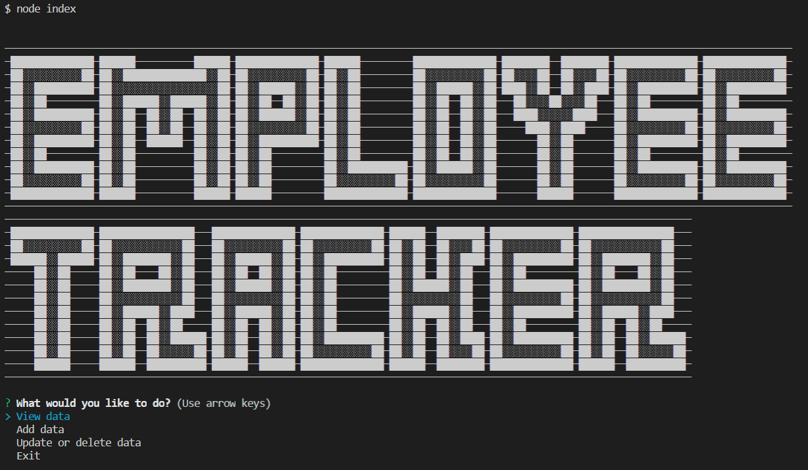
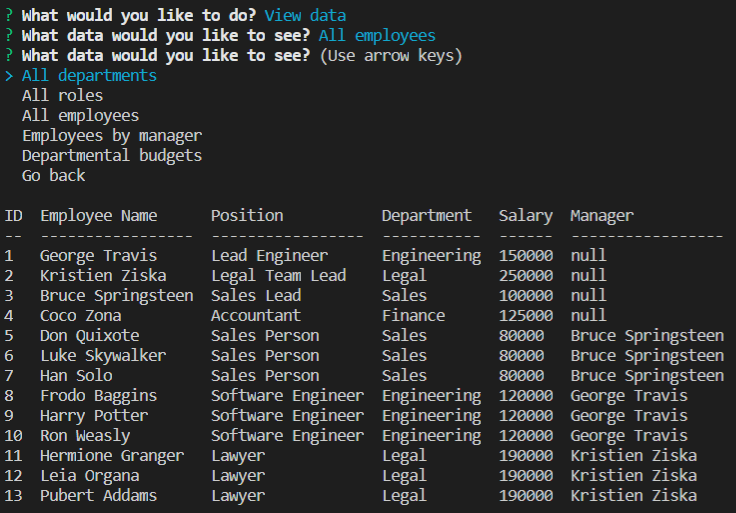

# Employee Tracker

This is an app enables a company to organize and budget employees and departments with simplicity.

Check out the repo [here](https://github.com/agtravis/employee-tracker).

This app runs in Node.JS - see [Setup](#setup) below for instructions on how to run

## Table of contents

- [General info](#general-info)
- [Screenshots](#screenshots)
- [Technologies](#technologies)
- [Code Examples](#code-examples)
- [Setup](#setup)
- [Features](#features)
- [Status](#status)
- [Contact](#contact)

## General info

This app uses SQL (Structured Query Language) queries within JavaScript running in Node.JS to interact with relational tables within a database in order to enable a company's administrator to easily manage a workforce. It is written with simplicity in mind, and many of the SQL queries are developed to ensure a seamless flow for the user - for example: When wishing to view a team being led by a manager the user selects the manager. In order to remove the prospect of an employee being selected who is not a manager (and therefore not returning any information), only employees who have other employees assigned to them (using a `foreign key` constraint) will be appear in the selection list.

## Screenshots

This is what the user sees when they first run the app.

A screen shot of when the user chooses to see all employees.

## Technologies

Here are the package.json dependencies:

"dependencies": {
"console.table": "^0.10.0",
"inquirer": "^7.0.4",
"mysql": "^2.18.1"
}

This package was written in JavaScript using Node.js, and the core is based around the npm package `Inquirer`, and uses `MySQL` to interact with the database. `console.table` is the package used to restyle the default `console.table` method, and this is optional and user preferential. If the GitHub repo is forked, in order to edit the code the user can run `npm i` to install this dependency.

The entry point for this app is `index.js`. On load, this file requires the modules mentioned above, then establishes the properties of the `connection` object, which holds all the information about how to interact with the database (the IP host (local in this case) and the port, the user and password for access to the database, and the name of the database). This object is passed to the connect function, and is continually passed around through all the functions until the user chooses to exit. The reason for this is because the functions are fully contained within their own module.

## Code Examples

There are basically two kinds of functions in this app. The first, and more basic, exlusively relies on user choices, and this is basically navigating 'levels' of the app's interface. For example:

    async function userSelect(connection) {
        const { selection } = await inquirer.prompt(prompts.select);
            switch (selection) {
                case 'View data':
                    viewDataChoice(connection);
                    break;
                case 'Add data':
                    addDataChoice(connection);
                    break;
                case 'Update or delete data':
                    updateOrDelete(connection);
                    break;
                default:
                    console.log(textArt.finish);
                    connection.end(connection);
        }
    }

This function is the entry point for the app. It presents the user with a few choices from which the user will navigate to their desired interaction or report. The prompts that do not require reading the database are stored in another module.

In this function, the user choices take them through to general and related areas of information or functions. All the 'view' type actions are grouped together in their own selection menu, so are all the different 'add' functions that are available. The update and delete functions are somewhat similar so they split up in the next sub-menu. They are similar because they require making SQL queries in order to present the user with specific choices (as do some of the view functions, but that would be too much seperation at this point).

Finally, this function has as its default response to end the connection to the database. This will happen when the user chooses exit. This is which the `connection` object is passed around, Since the user may choose to head to this menu and exit at any time.

Here is an example of a basic SQL query and how it interacts with the JavaScript:

    function viewData(connection, tableName) {
        connection.query(`SELECT * FROM ${tableName};`, (err, res) => {
            if (err) throw err;
            console.log(`\n${tableName} table:\n`);
            console.table(res);
            viewDataChoice(connection);
        });
    }

This is actually a function that takes two arguments. The first is the `connection` object, and the second is a string representing the table that is being viewed. Technically it could be used on ANY table since all it does is return ALL columns and records from that table. I only use it twice, because I prefer to return only useful and relevant information to the user. This function uses a `template literal` to insert the table name as a string into the SQL query. Any potential errors are handled per the standard Node.JS syntax, and then the results are logged to the console. Finally the function calls another function to return the user to the previous level of choices.

Here is a more complicated function:

    async function chooseManager(connection) {
        connection.query(
            `SELECT E1.id, E1.first_name, E1.last_name,
        CONCAT(E2.first_name, " ", E2.last_name) AS Manager
        FROM employee E1 LEFT JOIN employee E2 ON E1.manager_id = E2.id
        WHERE CONCAT(E2.first_name, " ", E2.last_name) IS NOT NULL`,
            async (err, res) => {
                if (err) throw err;
                    const choices = [];
                    for (let i = 0; i < res.length; ++i) {
                        if (!choices.includes(res[i].Manager)) {
                            choices.push(res[i].Manager);
                        }
                    }
                    let managerFullName;
                    const { manager } = await inquirer.prompt([
                        {
                            name: 'manager',
                            type: 'rawlist',
                            choices: choices,
                            message: 'Whose team would you like to see?'
                        }
                    ]);
                    let managerId;
                    connection.query(`SELECT * FROM employee`, (err, res) => {
                        if (err) throw err;
                        for (const row of res) {
                            row.fullName = `${row.first_name} ${row.last_name}`;
                            if (row.fullName === manager) {
                                managerId = row.id;
                                managerFullName = row.fullName;
                                continue;
                            }
                        }
                        connection.query(
                        `SELECT CONCAT(first_name, ' ', last_name) AS 'Employees managed by ${managerFullName}:' FROM employee WHERE manager_id = ${managerId}`,
                        (err, res) => {
                            if (err) throw err;
                            console.log(`\n`);
                            console.table(res);
                        }
                    );
                    viewDataChoice(connection);
                });
            }
        );
    }

This function is still within the view functions group. Here, the user wants to view a team which is run by a specific manager. This could be run just as a `SELECT ... WHERE` query, however this requires the user to choose their manager from an entire list of employees. It would be easier to only have to select from employees who are actually managers, and so that's what this function does.

The SQL query statement is a `SELF JOIN` where the manager_id is the foreign key. When the response is sent back, the code reads to see which names are in the manager column, and adds distinct names as they appear. This could be streamlined by applying an `INDEX`. These names are then presented, along with a 'None of the above' option, as part of the `inquirer.prompt` choices.

Due to the fact that I prefer to present the user with full names as one field via `CONCAT()`, I need to create a property on the response object to also concatenate the user choice to line up, and be able to reference the ID columns on which the tables are `JOIN`ed.

All functions are really only variations on this pattern. Some require nested queries in order to correctly assign data to fit the schema correctly and ensure consistency.

**NOTE**:

My `seed.sql` file sets up the tables to include the option to `ON DELETE CASCADE`. This means that when an item from a table is selection for deletion but it has a foreign key constraint on it that would ordinarily block the delete, it instead not only allows the delete, but also takes any associated records from other tables into oblivion with it. This is obviously something that is a choice of an administrator, and so I have opted to enable this feature, but the way my actual functions are set up does not present the user with an opportunity to perform this kind of delete. I filter user choices using various `JOIN`s to only display options that would result in a clean `DELETE` if there were no `CASCADE` enabled. If the user accesses the database directly via `MySQL`, they would be able to write their own code to delete anything they wanted, and I would assume in a real world application, the user would not have that access.

I decided it would be easier for the long term to set up a table with this feature enabled and then block access to it, rather than potentially decide to update the table at a later point.

## Setup

The user, after forking the repo, will need to run `npm i` in their console, but once that is undertaken, they will be able to run the app. They will need to access the `seed.sql` file and run the first half of this code if they wish to use my dummy data, for testing purposes.

## Features

This app tries to streamline the user experience. As I have mentioned previously, I have removed as much of the guess-work on the user's part as possible, and tried to make a plain-English, function application.

## Status

This app could be implemented into a company as is with a very rigid structure without too much more work done. It is not a complete database by any stretch, but as far as knowing who is an employee, and how much they get paid and to who they are responsible.

### Future Developement

In terms of the app and its usefulness, more data capacity and more tables could be added. For example, there should be a table with employee contact information, employee history with dates, or perhaps a list of projects that employees are working on. It could also be more flexible, having independent salaries, and multiple roles per employee.

As far as the code goes, I would like to split up my `functions.js` file, splitting them up into modules based on category of the functions (this file is 600 lines of code).

## Contact

Created by [@agtravis](https://agtravis.github.io/)
